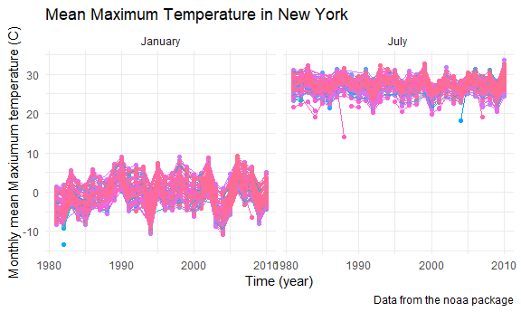

Visualization & EDA
================

    ## -- Attaching packages -------------------------------------------------------------- tidyverse 1.3.0 --

    ## v ggplot2 3.3.0     v purrr   0.3.4
    ## v tibble  3.0.1     v dplyr   0.8.5
    ## v tidyr   1.0.3     v stringr 1.4.0
    ## v readr   1.3.1     v forcats 0.5.0

    ## -- Conflicts ----------------------------------------------------------------- tidyverse_conflicts() --
    ## x dplyr::filter() masks stats::filter()
    ## x dplyr::lag()    masks stats::lag()

## Problem 1

``` r
data("instacart")
```

This dataset contains 1384617 rows and 15 columns. Observations are the
level of items in orders by users. There are users / order variables:
user ID, order ID, order day, order day. Time variables include name,
aisle, department, and some numeric codes. The information of the item
is matched with an order placed by a specific user. Each item belongs to
an aisle (with an aisle ID), which is further categorized under a
department (with a department ID).

**How many aisles are there? Which are most items from?**

``` r
instacart %>% 
  count(aisle) %>% 
  arrange(desc(n))
```

    ## # A tibble: 134 x 2
    ##    aisle                              n
    ##    <chr>                          <int>
    ##  1 fresh vegetables              150609
    ##  2 fresh fruits                  150473
    ##  3 packaged vegetables fruits     78493
    ##  4 yogurt                         55240
    ##  5 packaged cheese                41699
    ##  6 water seltzer sparkling water  36617
    ##  7 milk                           32644
    ##  8 chips pretzels                 31269
    ##  9 soy lactosefree                26240
    ## 10 bread                          23635
    ## # ... with 124 more rows

There are 134 aisles and most items come from “fresh vegetable”, “fresh
fruit” and “packaged vegetables fruits” aisles.

**Plot that shows the number of items ordered in each aisle**

``` r
instacart %>% 
  count(aisle) %>% 
  filter(n>10000) %>% 
  mutate(
    aisle = factor(aisle),
    aisle = fct_reorder(aisle,n)
  ) %>% 
  ggplot(aes(x=aisle, y=n))+geom_point()+theme(axis.text.x = element_text(angle=90, vjust=0.5,hjust=1))
```

<!-- -->

**Table showing the three most popular items in each of the aisles
“baking ingredients”, “dog food care”, and “packaged vegetables
fruits”**

``` r
instacart %>% 
  filter(aisle %in% c("baking ingredients", "dog food care", "packaged vegetables fruits") ) %>% 
  group_by(aisle) %>% 
  count(product_name) %>% 
  mutate(rank=min_rank(desc(n))) %>% 
  filter(rank<4) %>% 
  arrange(aisle,rank) %>% 
  knitr::kable()
```

| aisle                      | product\_name                                 |    n | rank |
| :------------------------- | :-------------------------------------------- | ---: | ---: |
| baking ingredients         | Light Brown Sugar                             |  499 |    1 |
| baking ingredients         | Pure Baking Soda                              |  387 |    2 |
| baking ingredients         | Cane Sugar                                    |  336 |    3 |
| dog food care              | Snack Sticks Chicken & Rice Recipe Dog Treats |   30 |    1 |
| dog food care              | Organix Chicken & Brown Rice Recipe           |   28 |    2 |
| dog food care              | Small Dog Biscuits                            |   26 |    3 |
| packaged vegetables fruits | Organic Baby Spinach                          | 9784 |    1 |
| packaged vegetables fruits | Organic Raspberries                           | 5546 |    2 |
| packaged vegetables fruits | Organic Blueberries                           | 4966 |    3 |

**Table showing the mean hour of the day at which Pink Lady Apples and
Coffee Ice Cream are ordered on each day of the week**

``` r
instacart %>% 
  filter(product_name %in% c("Pink Lady Apples","Coffee Ice Cream")) %>% 
  group_by(product_name,order_dow) %>% 
  summarise(mean_hour = mean(order_hour_of_day) ) %>% 
  pivot_wider(
    names_from = order_dow,
    values_from = mean_hour
  )
```

    ## # A tibble: 2 x 8
    ## # Groups:   product_name [2]
    ##   product_name       `0`   `1`   `2`   `3`   `4`   `5`   `6`
    ##   <chr>            <dbl> <dbl> <dbl> <dbl> <dbl> <dbl> <dbl>
    ## 1 Coffee Ice Cream  13.8  14.3  15.4  15.3  15.2  12.3  13.8
    ## 2 Pink Lady Apples  13.4  11.4  11.7  14.2  11.6  12.8  11.9

\#\#Problem 2

**load & clean data**

``` r
accel_df=
  read_csv("./accel_data.csv") %>% 
  janitor::clean_names() %>% 
  pivot_longer(
    activity_1:activity_1440,
    names_to = "minute_of_day",
    names_prefix = "activity_",
    values_to = "activity_count"
  ) %>% 
  mutate(
    week=as.numeric(week),
    day_id=as.numeric(day_id),
    day=as.factor(day),
    minute_of_day = as.integer(minute_of_day),
    activity_count = as.numeric(activity_count)
  ) %>% 
  mutate(weekday=case_when(
    day %in% c("Monday","Tuesday","Wednesday","Thursday","Friday") ~ "weekday",
    day %in% c("Saturday","Sunday") ~ "weekend"
  )
    
  )
```

    ## Parsed with column specification:
    ## cols(
    ##   .default = col_double(),
    ##   day = col_character()
    ## )

    ## See spec(...) for full column specifications.

This dataset contains the activity count measure by Accelerometers of a
63 year-old male with BMI 25 according to week, day, minute of the day
and whether it is weekend or not. There are 50400 observations, 6
variables.

**Total activity over the day**

``` r
accel_df %>% 
    mutate(
    day = factor(day),
    day_num = case_when(
      day == "Monday" ~ 1,
      day == "Tuesday" ~ 2,
      day == "Wednesday" ~3,
      day == "Thursday" ~4,
      day == "Friday" ~5,
      day == "Saturday" ~6,
      day == "Sunday" ~7
    ),
    day = fct_reorder(day,day_num)
  ) %>% 
  group_by(week,day) %>% 
  summarise(total_activity = sum(activity_count))%>% 
  pivot_wider(
    names_from = day,
    values_from = total_activity
  ) %>% 
  knitr::kable()
```

| week |    Monday |  Tuesday | Wednesday | Thursday |   Friday | Saturday | Sunday |
| ---: | --------: | -------: | --------: | -------: | -------: | -------: | -----: |
|    1 |  78828.07 | 307094.2 |    340115 | 355923.6 | 480542.6 |   376254 | 631105 |
|    2 | 295431.00 | 423245.0 |    440962 | 474048.0 | 568839.0 |   607175 | 422018 |
|    3 | 685910.00 | 381507.0 |    468869 | 371230.0 | 467420.0 |   382928 | 467052 |
|    4 | 409450.00 | 319568.0 |    434460 | 340291.0 | 154049.0 |     1440 | 260617 |
|    5 | 389080.00 | 367824.0 |    445366 | 549658.0 | 620860.0 |     1440 | 138421 |

This person is not as active on Saturday as other days in the week. His
activity is also more stable on Tuesday and Wednesday across the 5 weeks

**Activity over the course of the day**

``` r
accel_df %>% 
  ggplot (aes(x=minute_of_day, y=activity_count,color = day))+geom_smooth(se = FALSE)+
    labs(
    title = "Activity over the course of the day",
    x = "Minute of the Day",
    y = "Activity count"
  )
```

    ## `geom_smooth()` using method = 'gam' and formula 'y ~ s(x, bs = "cs")'

<!-- -->

Everyday, the activity count is usually low at mid-night and morning
(0-500 min, 12 o’clock to 8 o’clock) and stable at around 300 count at
day (500-1250 min, 8 o’clock to 21 o’clock) then drop again. However,
there is a peak activity at 500-750 min (8 o’clock to 12 o’clock) on
Sunday and 1250 min (21 o’clock) on Friday.

## Problem 3

load data

``` r
library(p8105.datasets)
data("ny_noaa")
```

This dataset contains the information and statistics of weather
information in New York. The dimension of this dataset is 2595176\*7.
Each weather station has an uniq id (id) and data were entered by date.
Weather statistics include precipitation, snowfall, snow depth, maximum
temperature and minimum temperature of the day. However, some weather
stations only record some of the information. For example, there are
1134420 missing observations for minumum temperature and 1134358 missing
from maximum temperature

clean data

``` r
noaa_df = 
  ny_noaa %>% 
    separate(date,into = c("year","month","day"),remove = TRUE,convert = TRUE) %>% 
mutate(
  tmax = as.numeric(tmax),
  tmin = as.numeric(tmin),
  prcp = prcp/10,
  tmax = tmax/10,
  tmin = tmin/10
)
```

**Most common observed snowfall value**

``` r
noaa_df %>% 
  drop_na(snow) %>% 
  count(snow) %>% 
  mutate(rank = min_rank(desc(n))) %>% 
  filter(rank<4)
```

    ## # A tibble: 3 x 3
    ##    snow       n  rank
    ##   <int>   <int> <int>
    ## 1     0 2008508     1
    ## 2    13   23095     3
    ## 3    25   31022     2

The most commonly observed snowfall value is 0, 13 and 25 mm

**Average max temperature in Januray and June**

``` r
noaa_df %>% 
  filter(month %in% c(1, 7)) %>% 
  mutate(
    monthname = case_when(
      month == 1 ~ "January",
      month == 7 ~ "July"
    )
  ) %>% 
  group_by(id,year,monthname) %>% 
  summarize(mean_tmax = mean(tmax),na.rm = TRUE) %>% 
  ggplot(aes(x=year,y=mean_tmax,group = id,color = id))+geom_point()+geom_path()+ theme(legend.position = "none")+facet_grid(. ~ monthname)+
  labs(
    title = "Mean Maximum Temperature in New York",
    x = "Time (year)",
    y = "Monthly mean Maxiumum temperature (C)",
    caption = "Data from the noaa package"
  )
```

    ## Warning: Removed 7058 rows containing missing values (geom_point).

    ## Warning: Removed 6147 row(s) containing missing values (geom_path).

<!-- -->

The maximum temperature in January and July both fluctuated between
years with the similar pattern (triangle-like shape) around every 5
years. For example, they are both higher at the beginning of 1990s, then
dropped during early 1990s and higher again in mid 1990s. There is an
outlier of max temperature (particular lower than others) in January
between 1980 and 1985 as well as outliers (particular lower than others)
in July between 1985 and 1990, 2000 to 2005 and 2006 to 2010

**tmax vs tmin & the distribution of snowfall**

``` r
p1 =
noaa_df %>% 
  ggplot(aes(x=tmin, y=tmax))+geom_bin2d()+theme(legend.position = "right")+
    labs(
    title = "Daily Maximum temperature vs. minimum temperature in New York",
    x = "Minimum daily temperature(C)",
    y = "Maxiumum daily temperature (C)",
    caption = "Data from the noaa package"
  )

p2=
noaa_df %>% 
  mutate(year=as.character(year)) %>% 
  filter(snow>0 & snow<100) %>% 
  ggplot(aes(x=year,y=snow))+geom_boxplot()+theme(axis.text.x = element_text(angle=90, vjust=0.5,hjust=1))+
    labs(
    title = "Distribution of snowfall in New York",
    x = "Time (year)",
    y = "Snowfall (mm)",
    caption = "Data from the noaa package
    Only snowfall greater than 0 and less than 100 is included"
  )

p1/p2
```

    ## Warning: Removed 1136276 rows containing non-finite values (stat_bin2d).

<!-- -->
